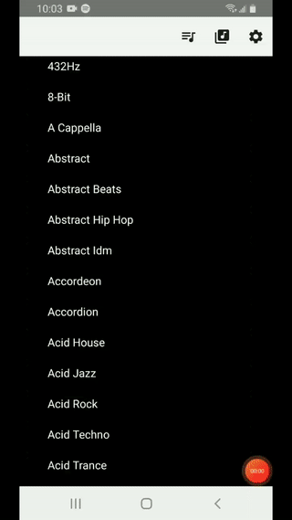
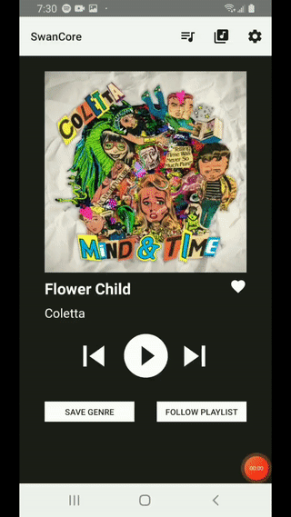
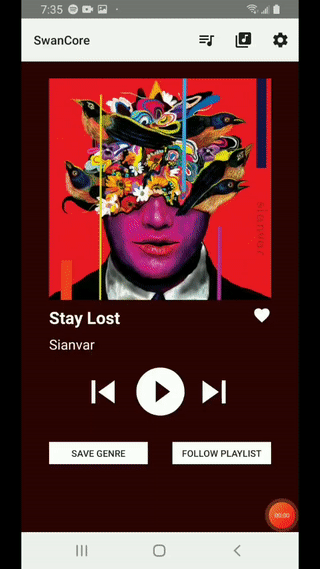
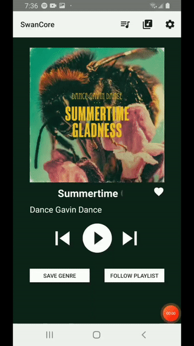

<h1 align="center">
   
  Genrefy
   
</h1>

<h4 align="center">An Android application for browsing Spotify by an extensive list of genres.</h4>

  <a href="#key-features">Key Features</a> •
  <a href="#usage">Usage</a> •
  <a href="#credits">Credits</a>

## Key Features

* Browse an extensive list of Spotify genres
  - Users can browse through 3000+ genres, gathered from a Kaggle CSV file and stored in a Firebase Realtime Database
* Browse playlists from a chosen genre
  - Users can discover playlists matching their selected genre
* Play songs from the selected playlist
  - Songs can be played on the Genrefy app, by using the Spotify Android SDK remote player
* Like songs
  - Users can add songs they like directly to their Spotify account
* Follow playlists
  - Users can follow playlists on their Spotify account
* Save genres
  - Users can save genres to the app (saved genres stored in the Firebase Realtime Database
* Adjust user preferences
  - Setting preferences include autoplay, text size, and background color
* Sign in with Firebase Authentication
  - Users can sign in by creating a username and password, or by using Google sign in
* Automatically authenticate with Spotify
  - After signing in through Firebase, users are automatically authenticated through the Spotify Android SDK authentication

## Usage
<h5> Discover new music by selecting a genre and related playlist to try out:</h5>

  

<h5> Add songs you like directly to your Spotify account:</h5>

  

<h5> Follow entire playlists you enjoy on your Spotify account:</h5>

  

<h5> Save genres you like on the Genrefy app to listen again later:</h5>

  

## Credits

Open source material used for this application:
- [Spotify Dataset 1922-2021, ~600k Tracks](https://www.kaggle.com/yamaerenay/spotify-dataset-19212020-160k-tracks?select=data_by_genres.csv) - List of 3000+ Spotify genres
- [Spotify Android SDK](https://github.com/spotify/android-sdk) - Spotify authentication & remote player
- [Spotify Web API for Android](https://github.com/kaaes/spotify-web-api-android) - Spotify API interaction
